# 📈 CryptoPulse Android

Ứng dụng Android theo dõi thị trường crypto thời gian thực.

## ✨ Tính năng
- Giá coin realtime qua Binance WebSocket
- Biểu đồ candlestick & phân tích kỹ thuật (RSI, MACD, Bollinger Bands)
- Fear & Greed Index tự tính
- Whale News dịch tiếng Việt
- On-chain wallet tracker
- Đăng nhập Email / Google (Firebase)
- Upload avatar (Cloudinary)
- Admin dashboard

## 🛠️ Tech Stack
- Java + Android SDK (minSdk 26)
- Firebase Auth + FCM
- Retrofit2 + OkHttp
- Binance WebSocket
- MPAndroidChart
- Cloudinary (avatar)
- Data Binding + ViewModel
## 📸 Screenshots

### 🏠 Home & Market

  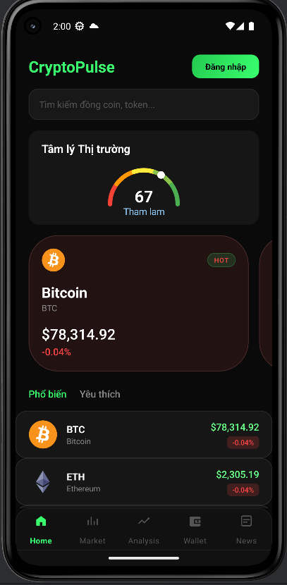
  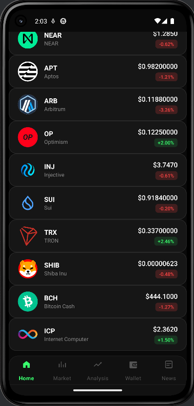
  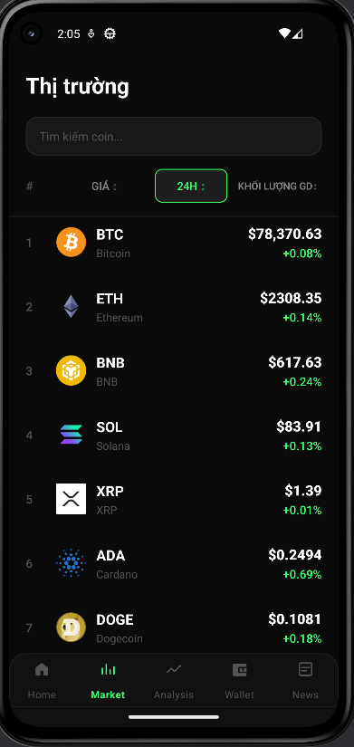
  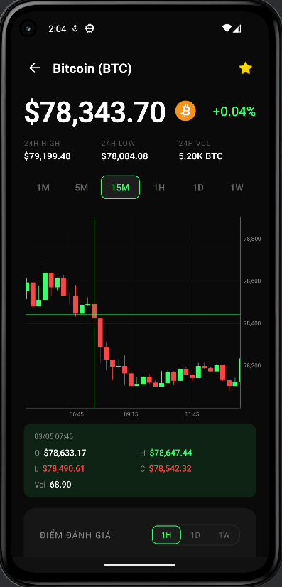
  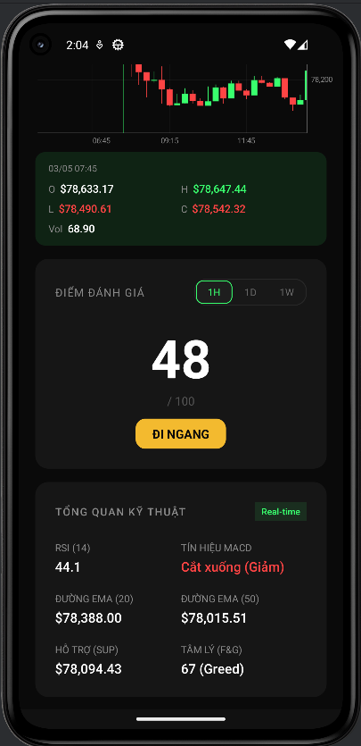

### 📊 Analysis

  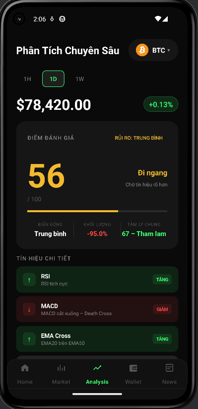
  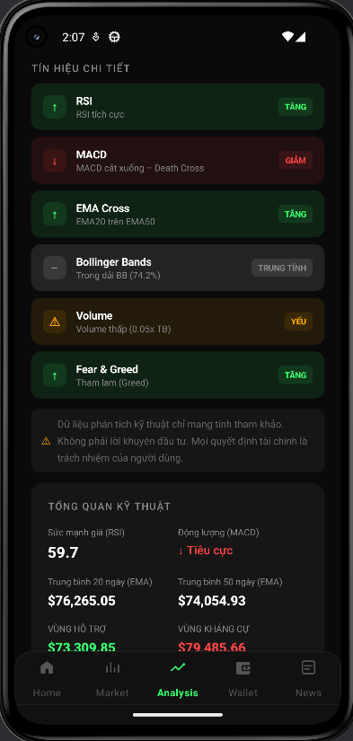
  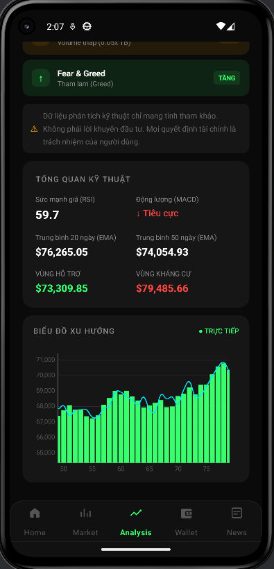

### 📰 News

  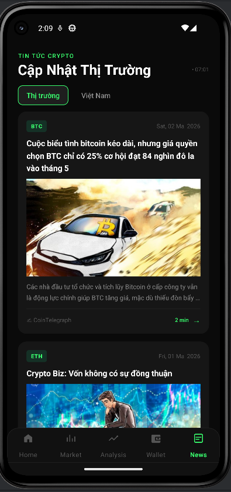
  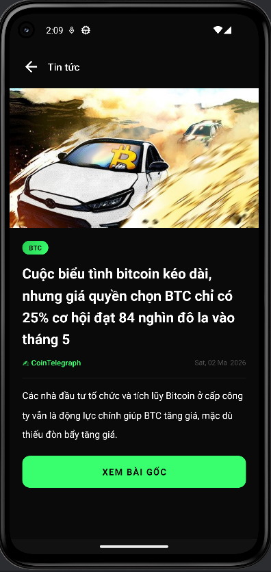
  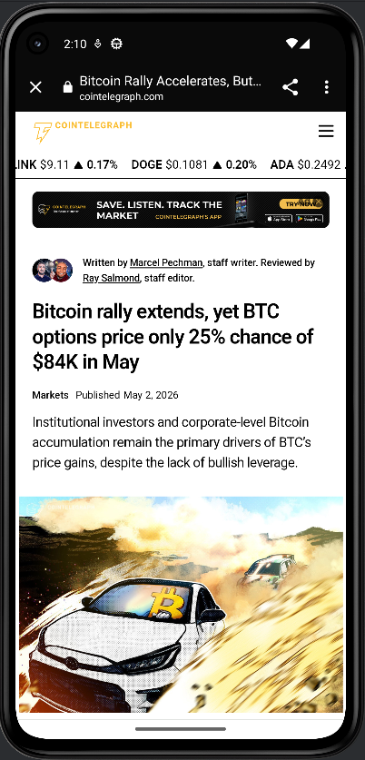

### 💼 Wallet

  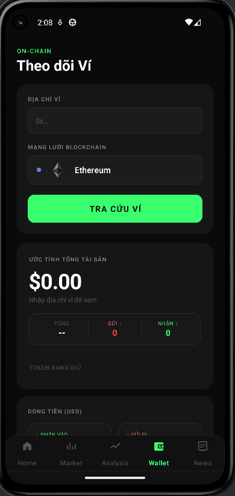
  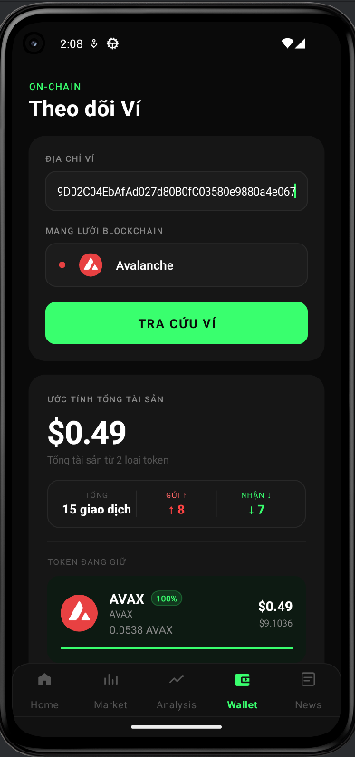
  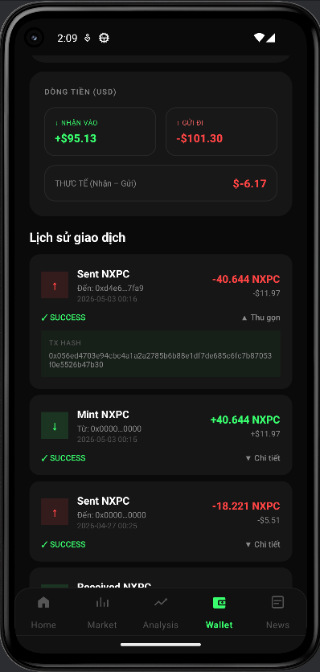

### 🔐 Auth

  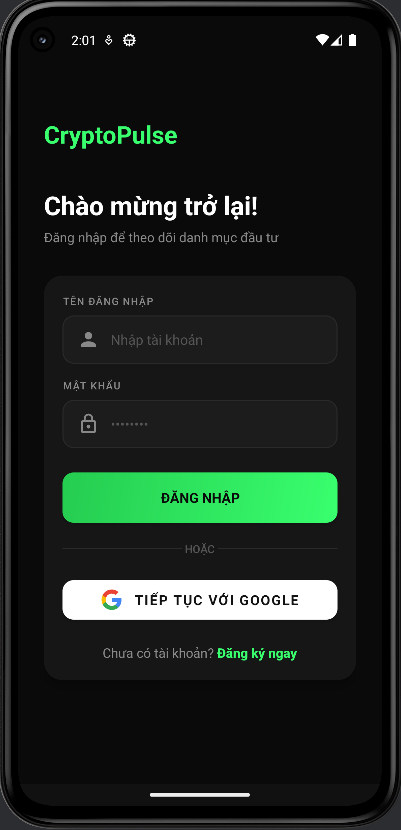
  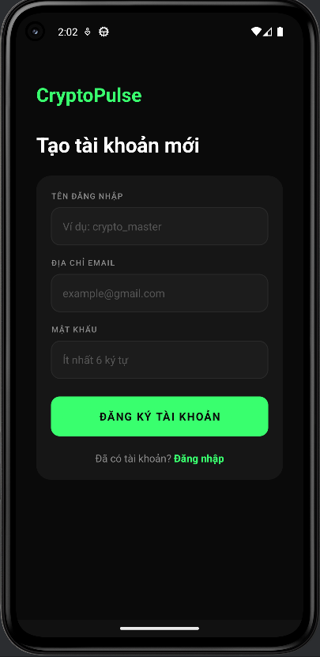
  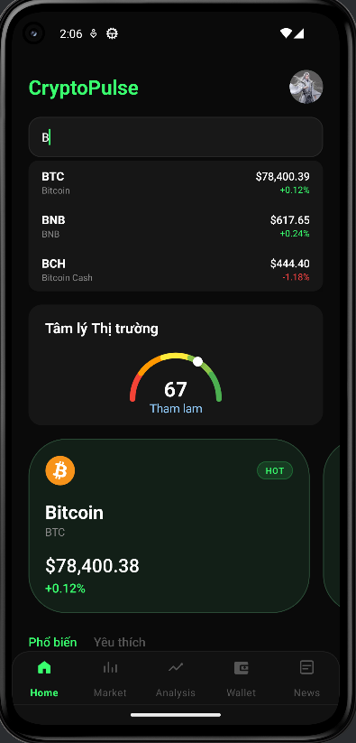

## 🚀 Setup
1. Clone repo
2. Thêm `google-services.json` vào `/app/`
3. Cập nhật backend URL trong `AppPrefs.java`
4. Run trên Android Studio

## 🌐 Backend
[CryptoPulse-Backend](https://github.com/bdnguyen2734work-cpu/CryptoPulse-Backend)